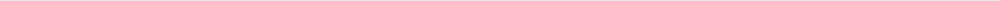
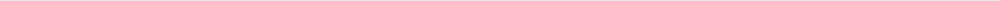
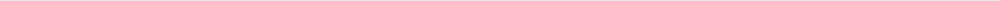

<div align="center">

# 🐦 Flutterify

### An AI-powered study companion for cracking Flutter / Dart / mobile system-design interviews.

A guided **60-day plan** that blends **theory**, **hands-on logic building**, and **system & architecture** — with an AI mentor that explains every concept *in depth and in plain English*, so you actually understand it instead of memorizing.

Built with **Next.js · Supabase · Google Gemini · Tailwind CSS**

</div>

---

## ✨ What it does

Flutterify turns a huge interview-prep curriculum (**1,400+ questions**) into a calm, day-by-day learning experience. Each day mixes three tracks:

- **📘 Theory** — Dart & Flutter concepts explained simply, with analogies and the *behind-the-scenes "why"* (not just definitions).
- **💻 Logic building** — coding drills where the mentor **guides your thinking without giving the solution**; a question is marked done only when you submit your own code.
- **🏗 System & Architecture** — mobile system design & solution-architecture questions (payments, offline-first, real-time, fintech, AI features, and more).

Every explanation is generated **once by AI, then cached** — so re-opening a question is instant and free, and everyone sees the same high-quality answer.

---

## 📸 Screenshots

> Replace the images in [`docs/screenshots/`](docs/screenshots/) with your own captures (same filenames) and they'll appear here automatically.

| Login | Dashboard |
|---|---|
|  |  |

| Day view (three tracks) | Question + AI answer |
|---|---|
|  |  |

<div align="center">



</div>

---

## 🚀 Key features

| | |
|---|---|
| 🧠 **In-depth AI answers** | Behind-the-scenes explanations in simple English, with analogies, trade-offs, "what breaks if you do it wrong", and an interview-ready summary. Length adapts to the topic. |
| 💾 **Answer caching** | Generated once and stored in Supabase — revisits load instantly and cost zero tokens. |
| ✅ **Progress tracking** | Mark questions done; logic questions are **code-gated**. Progress, streaks, and a **consistency heatmap** sync across devices. |
| 🃏 **Flashcards + quick revision** | Auto-generated flashcards and a collapsible "quick revision" gist for fast recall before interviews. |
| 🔒 **Google sign-in** | Supabase Auth (Google OAuth). Row-level security keeps each user's progress private. |
| 🎨 **Clean, modern UI** | Solid, friendly design with a dark sidebar and pastel day cards that preview each day's real topics. |
| 🛟 **Resilient** | Handles AI rate limits / quota gracefully, retries transient failures, and never shows half-broken answers. |

---

## 🛠 Tech stack

- **[Next.js 16](https://nextjs.org/)** (App Router, Turbopack) + **React 19** + **TypeScript**
- **[Supabase](https://supabase.com/)** — Postgres, Auth (Google OAuth), Row-Level Security
- **[Google Gemini](https://ai.google.dev/)** — free-tier LLM for answer generation
- **[Tailwind CSS](https://tailwindcss.com/)** — styling
- **[Vercel](https://vercel.com/)** — deployment

---

## 📂 Project structure

```
flutterify/
├─ content/curriculum/           # Source markdown (the actual question banks) — in-repo & reproducible
├─ scripts/parse-curriculum.mjs  # Turns the markdown into src/data/curriculum.json
├─ src/
│  ├─ app/                       # Next.js routes (dashboard, day, question, api/*)
│  ├─ components/                # UI (Sidebar, QuestionView, Flashcards, Heatmap…)
│  ├─ data/curriculum.json       # Generated curriculum the app reads at runtime
│  └─ lib/                       # Supabase clients, Gemini (llm.ts), prompts
├─ supabase/                     # schema.sql + migrations (run these in Supabase)
└─ docs/screenshots/             # README images
```

> The app reads the committed `src/data/curriculum.json` at runtime. The `content/curriculum/` markdown is the editable source — run `npm run parse` to regenerate the JSON after editing it.

---

## 🧑‍💻 Getting started (clone & run locally)

Each step notes **why** it's needed.

### Prerequisites
- **Node.js 18+** and npm
- A free **[Supabase](https://supabase.com/)** account
- A free **[Google AI Studio](https://aistudio.google.com/apikey)** API key

### 1. Clone & install

```bash
git clone https://github.com/Akashtripathi7/flutterify.git
cd flutterify
npm install
```

### 2. Set up Supabase (auth + database)

**Why:** Supabase stores your progress and the cached AI answers, and handles Google sign-in. Without it the app has nowhere to save data or log you in.

1. Create a new project at **[supabase.com](https://supabase.com/)**.
2. Open **SQL Editor → New query**, paste the contents of [`supabase/schema.sql`](supabase/schema.sql), and click **Run**. This creates the tables (`profiles`, `question_answers`, `progress`, `token_usage`) and their Row-Level-Security policies.
3. Then run [`supabase/RUN_THIS_MIGRATION.sql`](supabase/RUN_THIS_MIGRATION.sql) once (adds the `flashcards`/`code` columns and an update policy the app needs).
4. Enable Google sign-in: **Authentication → Providers → Google → enable**, add your Google OAuth client ID/secret, and set the redirect URL to `http://localhost:3000/auth/callback` (and later your Vercel URL).
5. Grab your keys from **Project Settings → API**: the **Project URL** and the **anon / publishable key**.

### 3. Set up Google Gemini (the AI mentor)

**Why:** Gemini generates the in-depth explanations. The app calls it only the *first* time each question is opened, then caches the answer — so it stays comfortably within the free tier.

1. Go to **[aistudio.google.com/apikey](https://aistudio.google.com/apikey)**.
2. Click **Create API key → Create API key in a new project**.
3. Copy the key — it must start with **`AIza`** (≈39 characters). If it starts with anything else, you copied the wrong value.

### 4. Add your environment variables

**Why:** The app reads secrets from `.env.local` at startup; it's git-ignored so your keys are never pushed.

```bash
cp .env.local.example .env.local
```

```env
# Supabase (Project Settings → API)
NEXT_PUBLIC_SUPABASE_URL=https://YOUR-PROJECT.supabase.co
NEXT_PUBLIC_SUPABASE_ANON_KEY=your-anon-or-publishable-key

# Google Gemini (must start with AIza)
GEMINI_API_KEY=AIza...
GEMINI_MODEL=gemini-2.5-flash

# Daily AI token budget per user (generation is blocked once exceeded)
DAILY_TOKEN_LIMIT=500000
```

**Which Gemini model?**
- `gemini-2.5-flash` — best quality, but the free tier allows only **~20 requests/day**.
- `gemini-2.0-flash` — **~200 requests/day** if enabled on your project (slightly lower quality).
- Because answers are cached after the first generation, each question costs **one** request, ever.

### 5. Run it

```bash
npm run dev        # start on http://localhost:3000
```

Handy scripts:

```bash
npm run dev:fresh  # frees port 3000 and restarts (if a stale server is stuck)
npm run kill       # kill all running dev servers
npm run parse      # regenerate src/data/curriculum.json from content/curriculum/
npm run build      # production build
```

---

## ☁️ Deploying to Vercel

1. Push to GitHub (the remote is already set to `origin`):
   ```bash
   git add -A
   git commit -m "Initial commit"
   git push -u origin main
   ```
2. On **[vercel.com](https://vercel.com/)** → **New Project** → import the `flutterify` repo.
3. Add the same environment variables (from your `.env.local`) under **Project → Settings → Environment Variables**.
4. In Supabase, add your Vercel URL to Google OAuth **redirect URLs**: `https://your-app.vercel.app/auth/callback`.
5. Deploy. Vercel rebuilds automatically on every push to `main`.

---

## 🔑 How the AI + caching works (in short)

1. You open a question → the app checks Supabase for a cached answer.
2. **Cache hit** → returns instantly, **zero tokens**.
3. **Cache miss** → calls Gemini with a tuned prompt (simple English, behind-the-scenes depth, length adapted to the topic), stores the answer + flashcards, then returns it.
4. Marking a question **done** records progress (logic questions require submitting your code first).

This keeps the app fast, cheap, and consistent — everyone gets the same well-crafted explanation.

---

## 📜 License

Personal / educational project. Use it, learn from it, make it your own.

<div align="center">

Made with ☕ and a lot of `setState()`.

</div>
